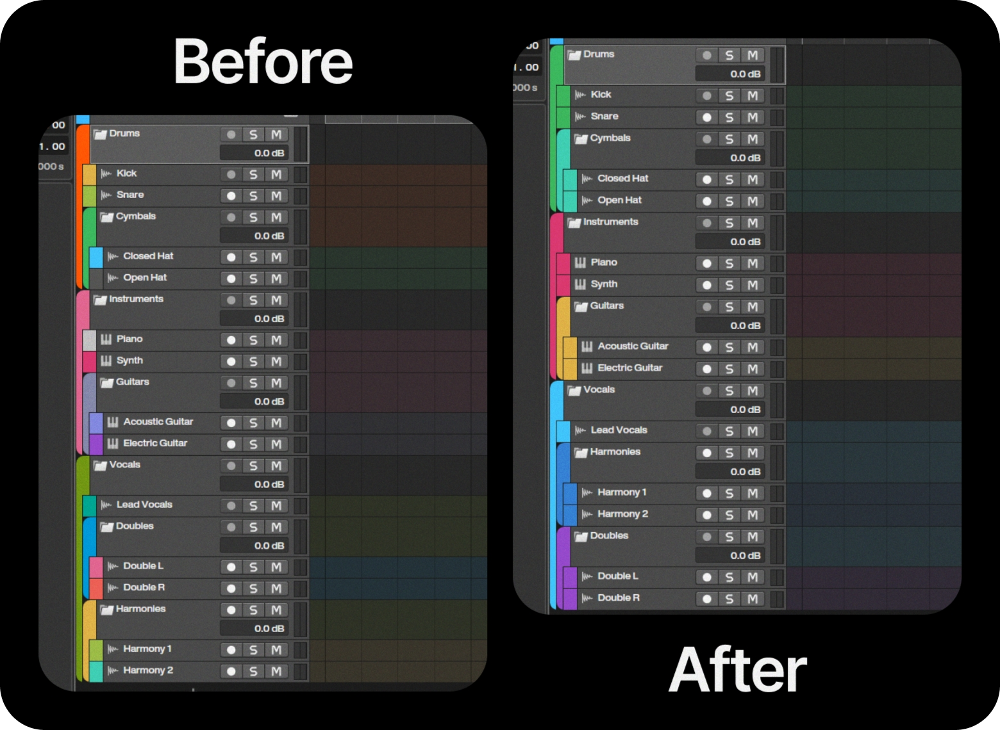

  

<h1 align="center">🎨 autocolor :)</h1>
<h3 align="center">keeps track colors matched with their group in Bitwig Studio</h3>

 

## Features

*  New tracks auto-match group color
*  Updates colors when tracks move between groups
*  Recolors child tracks when group color changes
*  Works with subgroups

**Tested on:** Bitwig 5.3.13 and Bitwig 6

 

## Installation
1. 👉 [Download the latest release](https://github.com/michaelvsn/autocolor/releases)
2. Copy **`michael-autocolor.control.js`** to your **My Controller Scripts** folder
   > You can find it here:
   > Dashboard → Settings → Locations → My Controller Scripts
3. Open **Dashboard → Settings → Controllers**
4. Click **Add Controller**
5. Set:

   * **Hardware Vendor:** `michael.vision`
   * **Script:** `autocolor :)`
     
6. Click **Add**
7. Done!

 

## Notes

* For projects with more than **999 tracks**, increase `MAX_TRACKS` in the '.js' file.
* I’m more of a musician than a coder, just made this to help me and my friends. Feel free to open a pull request :)
* When opening a project, tracks might recolor automatically. Disable the script first if you don’t want that.
* If a track didn’t recolor, click any other track and it should update.

 

## Credits

Based on an idea by **None Bits**. Big thanks!

His version recolored tracks when creating them inside groups,  
and **autocolor :)** takes it a step further by updating colors when tracks move or when group colors change.

 

Made by [@michaelvsn](https://github.com/michaelvsn)

## Support

If you like the script, give it a ⭐ or share it. That’s the best support ❤️

## Disclaimer

Unofficial community script, not made or endorsed by Bitwig.
